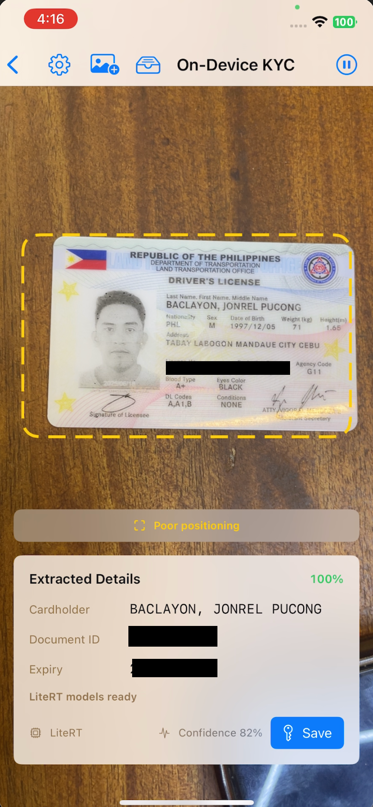
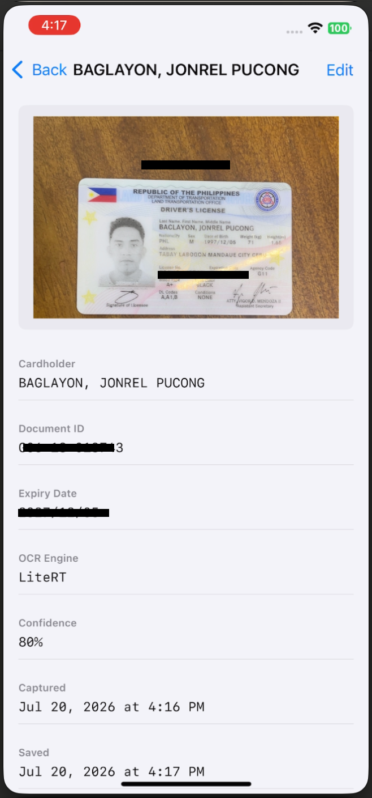
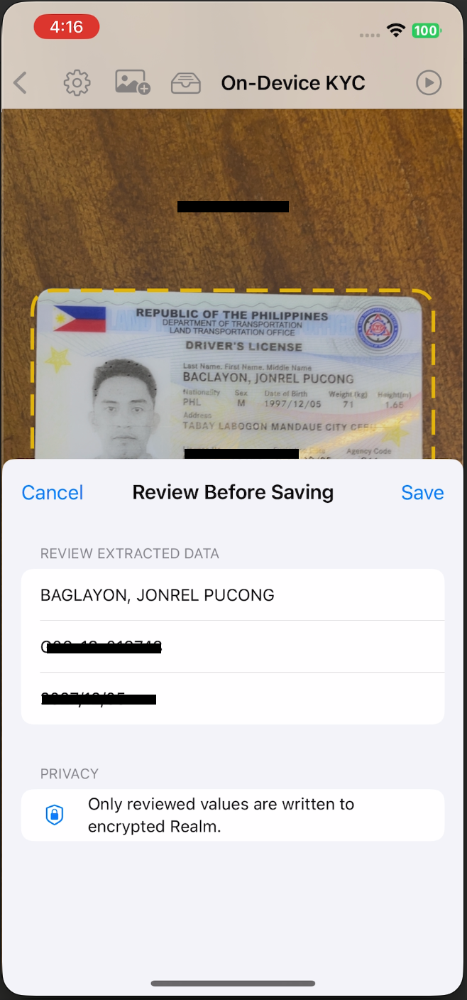
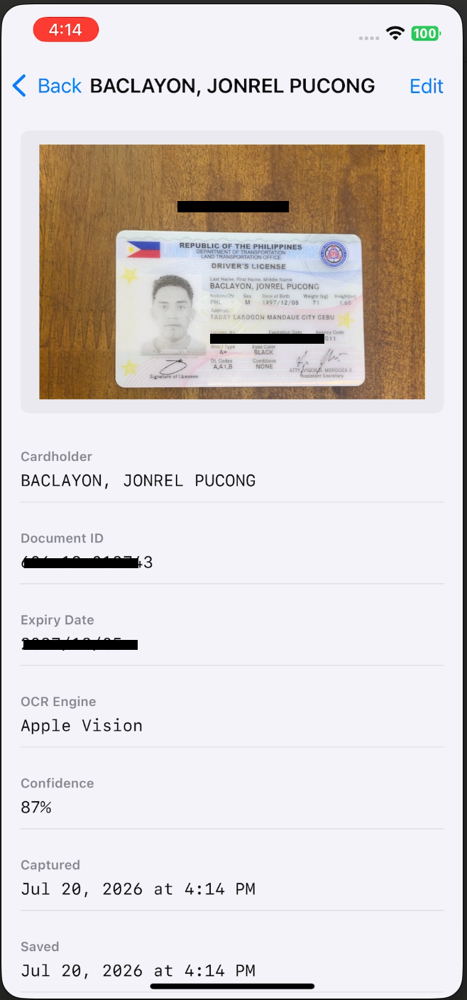
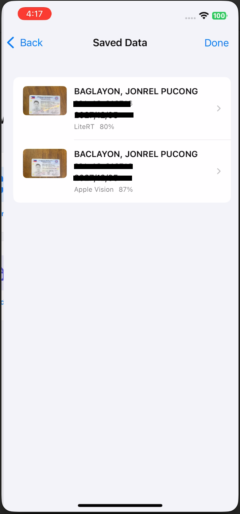
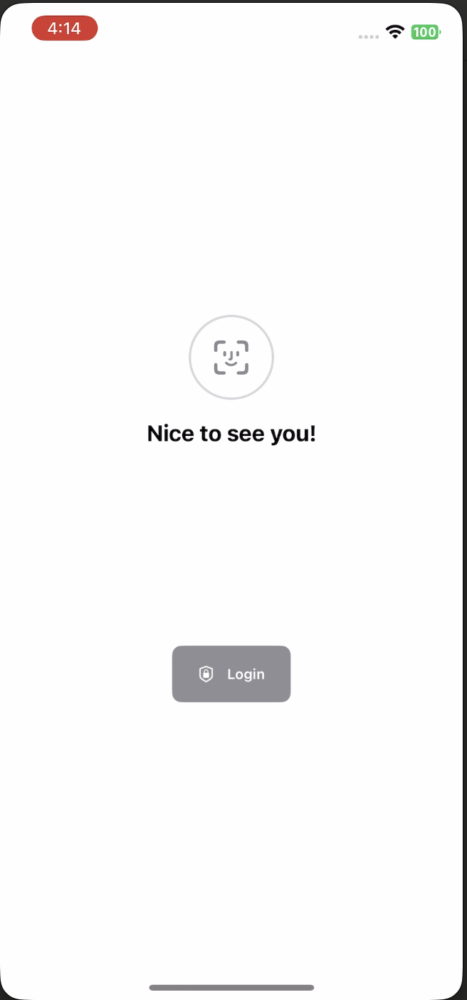
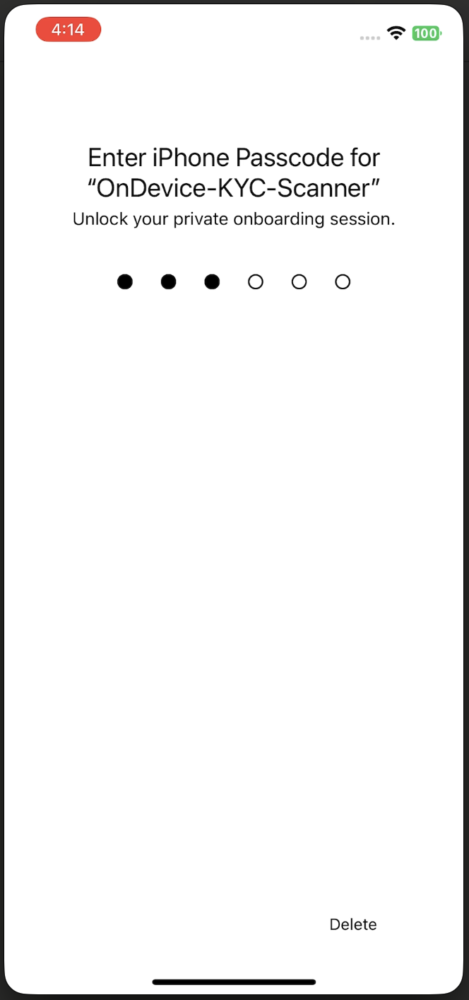
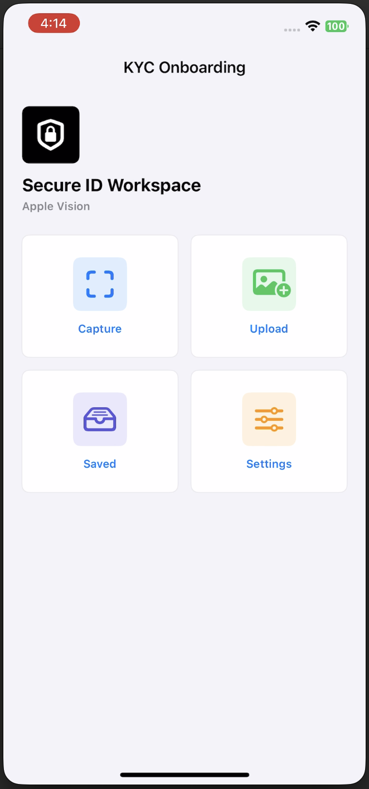
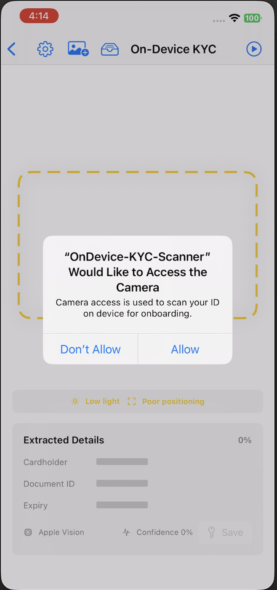
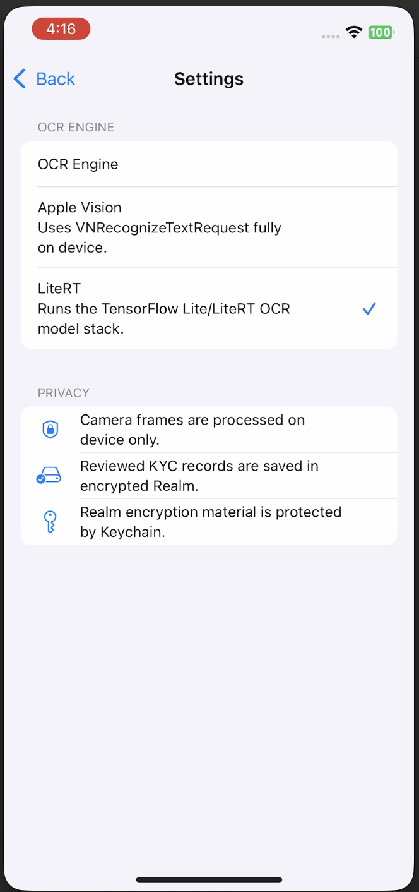

# OnDevice KYC Scanner

A native SwiftUI app for scanning ID and KYC documents on device. It supports biometric or passcode unlock, live camera capture, photo upload, local OCR, editable review, encrypted local record storage, and protected image snapshots.

## Screenshots

| | | |
|---|---|---|
|  |  |  |
|  |  |  |
|  |  |  |
|  | | |

## Features

- Face ID, Touch ID, or device passcode unlock with `LocalAuthentication`.
- Short-lived authenticated session with automatic expiry.
- Live camera scanning with `AVCaptureSession` and `AVCaptureVideoPreviewLayer`.
- Static image upload from Photos.
- On-device OCR using Apple Vision.
- Optional TensorFlow Lite / LiteRT OCR path using bundled PP-OCR `.tflite` assets.
- Real-time scan quality feedback for low light, low OCR confidence, and poor positioning.
- Editable review before saving extracted KYC data.
- Local Realm storage for reviewed KYC records.
- Protected local JPEG snapshots for saved document images.

## User Flow

1. Unlock the app with biometrics or device passcode.
2. Choose Capture, Upload, Saved, or Settings from the dashboard.
3. Capture opens the live scanner and guides the user to place the ID in frame.
4. OCR extracts the cardholder name, document ID, and expiry date.
5. Save captures the current frame, crops around the scanner guide, and opens an editable review sheet.
6. Reviewed records are saved locally and can be viewed or edited from Saved.
7. Upload runs OCR on a selected image and opens the extracted result when ID data is found.

## Privacy And Security

- Camera frames are processed on device.
- OCR runs locally through Apple Vision or bundled LiteRT models.
- The app does not send raw document images to a remote server.
- Login persistence stores only a session expiry timestamp.
- Realm encryption material is generated locally and stored in Keychain with `kSecAttrAccessibleWhenUnlockedThisDeviceOnly`.
- Saved image snapshots are stored under Application Support with complete file protection and excluded from backup.

## OCR Engines

### Apple Vision

`VisionOCRService` uses `VNRecognizeTextRequest` for local text recognition, then parses recognized lines into KYC fields with local rules.

### TensorFlow Lite / LiteRT

`TensorFlowLiteOCRService` loads the bundled PP-OCR detector and recognizer models through the `TensorFlowLite` Swift module. The LiteRT path runs detector inference, crops detected text regions, runs recognizer inference, decodes output with `ppocrv5_dict.txt`, and feeds decoded text into the KYC parser.

Apple Vision remains available as a fallback when LiteRT does not return readable text for a frame.

## Project Structure

```text
OnDevice-KYC-Scanner/
  Domain/
    KYCDocument.swift
  Services/
    BiometricAuthenticationService.swift
    CameraCaptureService.swift
    ImageSnapshotService.swift
    KeychainPIIStore.swift
    PPOCRModelResources.swift
    RealmKYCRecordStore.swift
    TensorFlowLiteOCRService.swift
    VisionOCRService.swift
  ViewModels/
    BiometricLockViewModel.swift
    OnboardingCoordinatorViewModel.swift
    SavedKYCRecordsViewModel.swift
    ScannerViewModel.swift
  Views/
    BiometricLockView.swift
    CameraPreviewView.swift
    KYCRecordEditorView.swift
    LandingView.swift
    LoginView.swift
    OCRSettingsView.swift
    SavedKYCRecordsView.swift
    ScannerView.swift
  Resources/
    OCRModels/
      ppocr_det_fp16.tflite
      ppocr_rec_fp16.tflite
      ppocrv5_dict.txt

Packages/
  KYCOCRSupport/
```

## Dependencies

- RealmSwift through Swift Package Manager
- Local Swift package: `Packages/KYCOCRSupport`
- TensorFlowLiteSwift through CocoaPods

## Model Assets

Bundled OCR model files live in:

```text
OnDevice-KYC-Scanner/Resources/OCRModels/
```

Expected files:

- `ppocr_det_fp16.tflite`
- `ppocr_rec_fp16.tflite`
- `ppocrv5_dict.txt`

## Requirements

- Xcode 16 or newer
- iOS 17.0 or newer
- CocoaPods
- Physical iPhone recommended for camera and biometric testing

## Setup

1. Clone the repository.
2. Install CocoaPods dependencies:

```bash
pod install
```

3. Open the workspace:

```bash
open OnDevice-KYC-Scanner.xcworkspace
```

4. Select the `OnDevice-KYC-Scanner` scheme.
5. Run on a physical iOS device for camera and biometric testing.

## Build From Terminal

```bash
xcodebuild \
  -workspace OnDevice-KYC-Scanner.xcworkspace \
  -scheme OnDevice-KYC-Scanner \
  -destination 'generic/platform=iOS' \
  CODE_SIGNING_ALLOWED=NO \
  build
```

## Limitations

- OCR field extraction uses local heuristics and should be tuned for each supported document template.
- LiteRT OCR accuracy depends on the bundled model quality, input lighting, camera focus, and document alignment.
- This app is not a complete production KYC compliance system.
